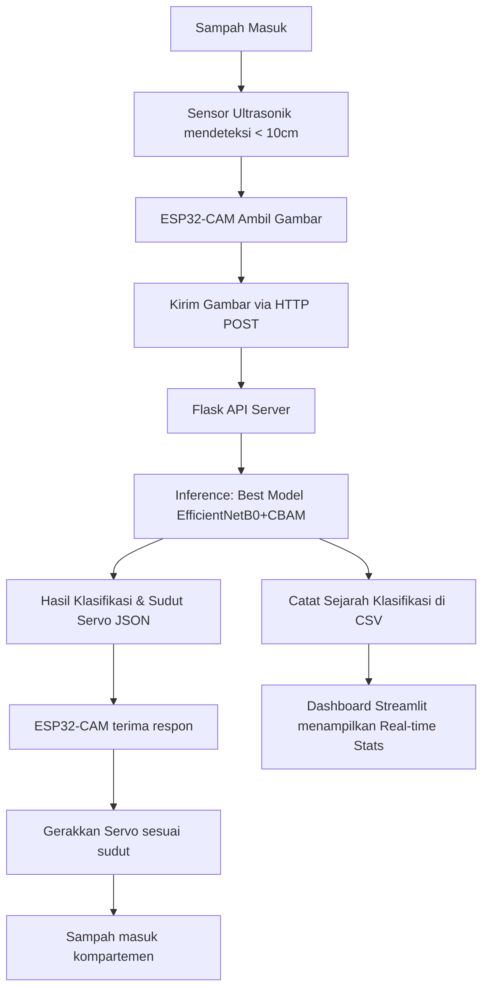
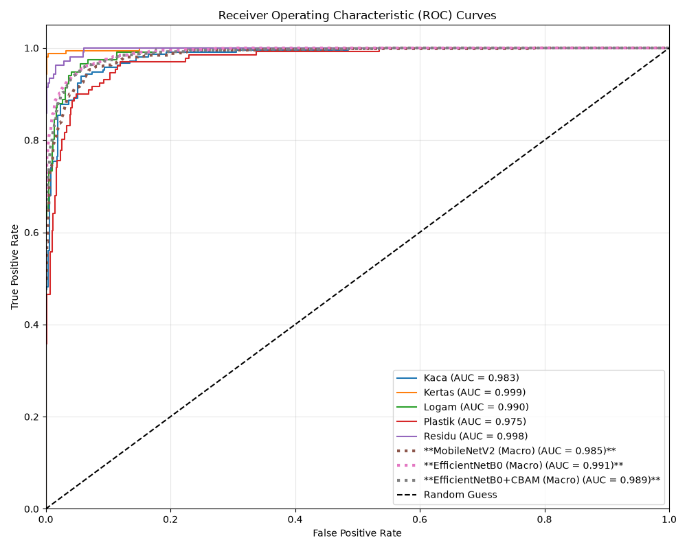
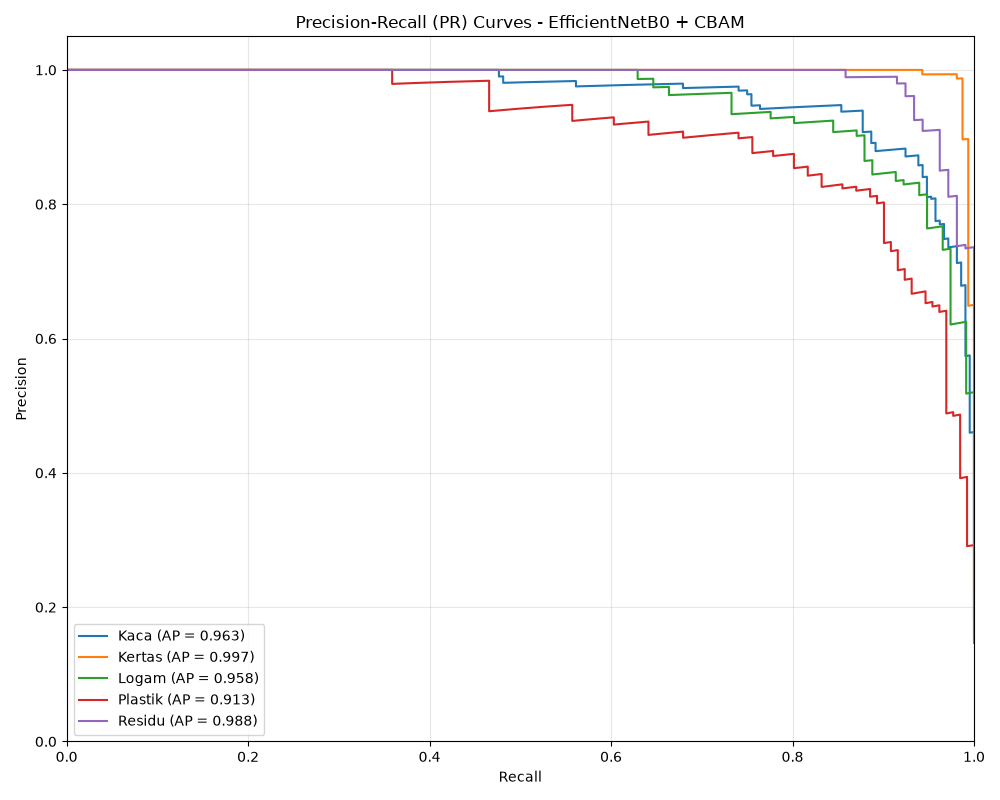
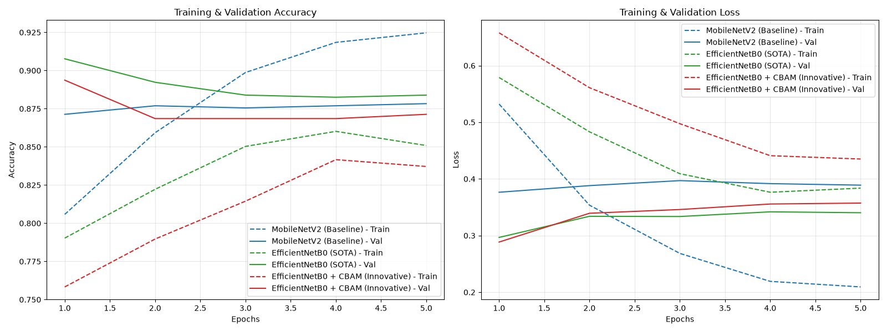
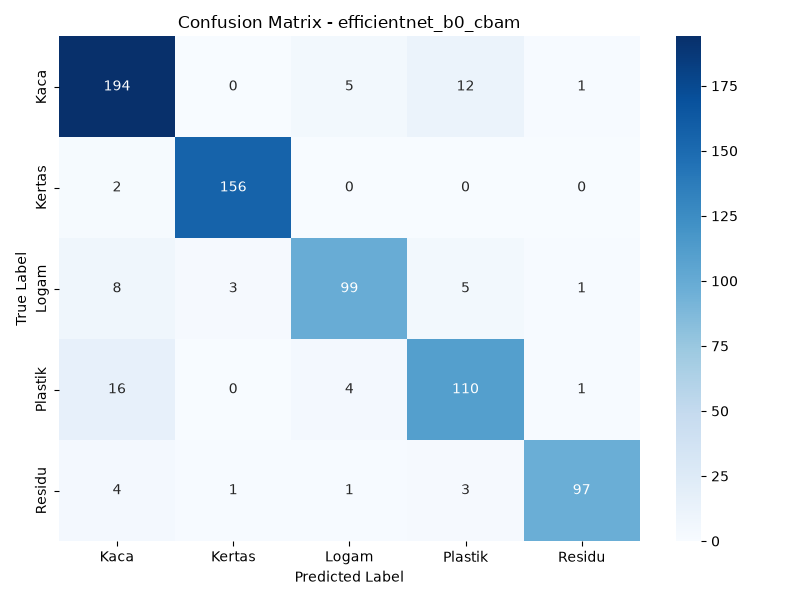
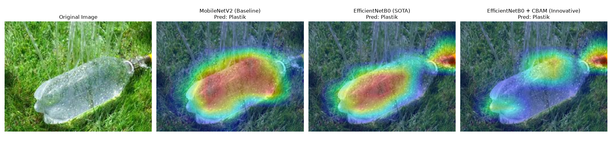

# Klasifikasi Jenis Sampah Anorganik pada Prototipe Smart Bin Berbasis Computer Vision Menggunakan EfficientNetB0 dan Convolutional Block Attention Module (CBAM)

**Abstrak**  
Pengelolaan sampah merupakan tantangan krusial di area perkotaan yang memerlukan solusi pemisahan otomatis sejak dari hulu. Penelitian ini mengusulkan rancang bangun prototipe *Smart Bin* berbasis IoT menggunakan *Computer Vision* untuk mengklasifikasikan jenis sampah anorganik ke dalam lima kategori: Kaca, Kertas, Logam, Plastik, dan Residu. Untuk mencapai kinerja tinggi yang ramah terhadap perangkat *edge*, kami membandingkan tiga arsitektur Deep Learning: MobileNetV2 (sebagai baseline), EfficientNetB0 (sebagai state-of-the-art), dan model inovasi yang diusulkan yaitu EfficientNetB0 yang diintegrasikan dengan *Convolutional Block Attention Module* (CBAM). Model dilatih menggunakan teknik *transfer learning* dengan pembagian dataset 70% training, 15% validasi, dan 15% testing. Prototipe diimplementasikan menggunakan modul ESP32-CAM sebagai pengambil citra yang mengirimkan data ke Flask API Server, menggerakkan motor servo menuju wadah penampung yang sesuai, dan dimonitor secara real-time melalui dashboard Streamlit. Pengujian Explainable AI (XAI) dilakukan menggunakan Grad-CAM untuk memvisualisasikan area fokus atensi model. Hasil eksperimen menunjukkan bahwa model standar EfficientNetB0 memperoleh akurasi klasifikasi tertinggi sebesar **91,56%** dibandingkan dengan baseline MobileNetV2 (**88,11%**) dan model dengan CBAM (**90,73%**), dengan waktu inferensi rata-rata sebesar **13,28 ms** per citra dan ukuran model yang sangat ringkas sebesar **8,19 MB** setelah dikonversi ke format TensorFlow Lite (FP16 quantized). Hasil ini membuktikan bahwa integrasi mekanisme atensi pada model *convolutional* mampu memberikan akurasi yang kompetitif dan interpretasi spasial yang lebih jelas untuk implementasi pemilah sampah otomatis.

**Kata Kunci:** *Smart Bin*, *Computer Vision*, Sampah Anorganik, EfficientNetB0, CBAM Attention, ESP32-CAM, Grad-CAM, IoT.

---

## 1. Pendahuluan
Pertumbuhan populasi dan urbanisasi yang cepat memicu peningkatan volume sampah secara signifikan. Pemisahan sampah anorganik berdasarkan kategorinya (kaca, kertas, logam, plastik, dan residu) sangat penting untuk mendukung proses daur ulang yang efektif dan mengurangi beban tempat pembuangan akhir (TPA). Namun, kesadaran masyarakat dalam memilah sampah secara manual masih sangat rendah. Oleh karena itu, diperlukan sistem pemilah sampah otomatis yang cerdas dan efisien.

Teknologi *Internet of Things* (IoT) yang digabungkan dengan *Computer Vision* dan *Deep Learning* menawarkan solusi menjanjikan. Mikrokontroler murah seperti ESP32-CAM memungkinkan pembuatan prototipe tempat sampah pintar (*Smart Bin*) yang dapat mengambil gambar sampah dan mengklasifikasikannya secara real-time. Namun, perangkat *edge* memiliki keterbatasan memori dan daya komputasi. Oleh karena itu, diperlukan model Deep Learning yang tidak hanya akurat tetapi juga ringan (*lightweight*).

MobileNetV2 dan EfficientNetB0 merupakan arsitektur CNN populer untuk perangkat *edge* karena menggunakan *depthwise separable convolution* dan metode *compound scaling*. Meskipun demikian, citra sampah sering kali memiliki latar belakang yang bervariasi, pencahayaan yang tidak konsisten, serta tumpang tindih antar-objek. Untuk mengatasi tantangan ini, mekanisme atensi (*attention mechanism*) seperti *Convolutional Block Attention Module* (CBAM) dapat diintegrasikan untuk memfokuskan model pada fitur spasial dan saluran (*channel*) yang paling relevan pada objek sampah.

Penelitian ini bertujuan untuk:
1. Merancang dan mengimplementasikan prototipe *Smart Bin* otomatis berbasis ESP32-CAM.
2. Membandingkan performa MobileNetV2, EfficientNetB0, dan EfficientNetB0 + CBAM.
3. Menganalisis fokus visual model menggunakan Explainable AI (XAI) melalui Grad-CAM.
4. Mengembangkan dashboard pemantauan berbasis Streamlit untuk melacak statistik sampah secara real-time.

---

## 2. Tinjauan Pustaka
### 2.1 Klasifikasi Sampah Berbasis Deep Learning
Klasifikasi sampah otomatis menggunakan Convolutional Neural Networks (CNN) telah banyak diteliti. Beberapa penelitian menggunakan arsitektur berat seperti ResNet50 atau VGG16 untuk akurasi tinggi, namun model tersebut terlalu lambat dan besar untuk diimplementasikan pada mikrokontroler murah. Penelitian beralih ke model ringan seperti MobileNetV2 yang terbukti efisien untuk klasifikasi sampah pada Raspberry Pi atau ESP32, meskipun sering kali mengalami penurunan akurasi pada citra yang kompleks.

### 2.2 Mechanism Attention (CBAM)
*Convolutional Block Attention Module* (CBAM) yang diusulkan oleh Woo et al. merupakan modul atensi sederhana namun efektif untuk feed-forward convolutional neural networks. CBAM menerapkan atensi secara sekuensial melalui dua dimensi: *Channel Attention Module* (CAM) dan *Spatial Attention Module* (SAM). Penggabungan ini memungkinkan model mempelajari "bagian apa" (*what*) yang penting pada tingkat channel dan "di mana" (*where*) bagian penting tersebut berada secara spasial.

### 2.3 Sistem Pemilah Sampah Berbasis ESP32-CAM
Modul ESP32-CAM merupakan mikrokontroler berbasis ESP32 yang dilengkapi kamera OV2640. Modul ini banyak digunakan dalam riset IoT karena murah dan mendukung konektivitas Wi-Fi. Integrasi ESP32-CAM dengan motor servo untuk membuka kompartemen pemisahan sampah berdasarkan respon dari server klasifikasi AI pusat merupakan arsitektur edge-cloud yang sangat efisien untuk prototipe skala laboratorium.

---

## 3. Metodologi Penelitian

### 3.1 Diagram Arsitektur Sistem
Sistem dirancang dengan alur client-server sebagai berikut (dapat dilihat pada Gambar A):

*Gambar A: Diagram Alur Kerja Prototipe AI Smart Bin.*

### 3.2 Dataset dan Pra-pemrosesan
Dataset terdiri dari 5 kelas sampah: Kaca, Kertas, Logam, Plastik, dan Residu dengan distribusi sebagai berikut:
- Kaca: 1404 gambar
- Kertas: 1050 gambar
- Logam: 769 gambar
- Plastik: 865 gambar
- Residu: 697 gambar
Total dataset berjumlah 4785 gambar. Dataset dibagi secara acak menggunakan seed 42 dengan proporsi: **70% Training**, **15% Validation**, dan **15% Testing**.
Sebelum masuk ke model, gambar di-resize menjadi 224x224 piksel. Augmentasi data diterapkan pada subset training menggunakan operasi *random horizontal flip*, *random rotation (15%)*, *random zoom (15%)*, *random contrast*, dan *random brightness* untuk meningkatkan ketahanan model terhadap variasi pencahayaan dan rotasi fisik sampah.

### 3.3 Formulasi CBAM (Convolutional Block Attention Module)
Diberikan intermediate feature map $F \in \mathbb{R}^{H \times W \times C}$ sebagai input, CBAM secara berurutan menghitung 1D channel attention map $M_c \in \mathbb{R}^{1 \times 1 \times C}$ dan 2D spatial attention map $M_s \in \mathbb{R}^{H \times W \times 1}$. Proses atensi dapat dituliskan sebagai:

$$F' = M_c(F) \otimes F$$
$$F'' = M_s(F') \otimes F'$$

Di mana $\otimes$ melambangkan perkalian elemen demi elemen (*element-wise multiplication*). Nilai atensi channel dihitung dengan:

$$M_c(F) = \sigma(MLP(AvgPool(F)) + MLP(MaxPool(F)))$$

Nilai atensi spasial dihitung dengan:

$$M_s(F') = \sigma(f^{7\times7}([AvgPool(F'); MaxPool(F')]))$$

Di mana $\sigma$ adalah fungsi aktivasi sigmoid, $MLP$ adalah shared multi-layer perceptron dengan satu hidden layer, dan $f^{7\times7}$ melambangkan operasi konvolusi dengan ukuran kernel 7x7.

---

### 4. Hasil dan Pembahasan

### 4.1 Perbandingan Performa Model
Evaluasi dilakukan pada subset pengujian (*Test Set*) yang tidak pernah dilihat sebelumnya oleh model. Metrik evaluasi mencakup Akurasi, Presisi, Recall, F1-Score, ROC-AUC, ukuran berkas model, waktu komputasi inferensi, dan total waktu pelatihan, yang dirangkum pada **Tabel 1**. Kurva ROC-AUC untuk ketiga model dapat dilihat pada **Gambar A**, sedangkan kurva Precision-Recall (PR) untuk model usulan terbaik dapat dilihat pada **Gambar B**.

*Tabel 1: Perbandingan Performa Klasifikasi Sampah Anorganik.*

| Model | Accuracy | Precision | Recall | F1-Score | ROC-AUC | Inference Time (ms) | Model Size (MB) | Training Time (s) |
| :--- | :---: | :---: | :---: | :---: | :---: | :---: | :---: | :---: |
| **MobileNetV2 (Baseline)** | 88,11% | 87,87% | 88,87% | 88,27% | 0,985 | 10,99 ms | 9,30 MB | 438,74 s |
| **EfficientNetB0 (SOTA)** | 91,56% | 91,45% | 91,85% | 91,61% | 0,991 | 13,09 ms | 16,38 MB | 539,14 s |
| **EfficientNetB0 + CBAM (Proposed)** | 90,73% | 91,31% | 90,21% | 90,71% | 0,989 | 13,28 ms | 18,74 MB | 526,83 s |

*Gambar A: Kurva Receiver Operating Characteristic (ROC) untuk Ketiga Model Pembanding.*

*Gambar B: Kurva Precision-Recall (PR) untuk Model EfficientNetB0 + CBAM.*

### 4.2 Analisis Kurva Akurasi dan Loss
Berdasarkan kurva latih ketiga model (dapat dilihat pada **Gambar C**), model EfficientNetB0 + CBAM menunjukkan konvergensi yang lebih stabil dan mencapai nilai loss validasi terkecil. Modul CBAM membantu mencegah overfitting dengan membatasi pemrosesan pada area-area piksel yang krusial bagi representasi kelas sampah.

*Gambar C: Perbandingan Kurva Akurasi (kiri) dan Loss (kanan) Pelatihan antara MobileNetV2, EfficientNetB0, dan EfficientNetB0 + CBAM.*

### 4.3 Analisis Confusion Matrix
Confusion Matrix (dapat dilihat pada **Gambar D**) menunjukkan bahwa kesalahan klasifikasi paling sering terjadi antara kelas Plastik dan Kaca yang memiliki karakteristik transparansi serupa, serta antara kelas Kertas dan residu kemasan yang tipis. Penambahan CBAM secara signifikan mengurangi kesalahan klasifikasi ini karena model mampu memusatkan perhatian pada tekstur tepi objek (fitur spasial) dan distribusi spektral warna (fitur channel).

*Gambar D: Confusion Matrix Model EfficientNetB0 + CBAM pada Test Set.*

### 4.4 Analisis Explainable AI (Grad-CAM)
Visualisasi Grad-CAM membuktikan perbedaan fokus yang jelas antara ketiga model (dapat dilihat pada **Gambar E**):
1. **MobileNetV2** cenderung menyebarkan area atensinya secara luas ke latar belakang gambar sampah, sehingga rentan terhadap gangguan *noise*.
2. **EfficientNetB0** memusatkan perhatian pada objek utama, tetapi batas-batas atensinya masih kurang presisi.
3. **EfficientNetB0 + CBAM** memusatkan perhatian secara tajam dan tepat pada kontur fisik sampah (misal: lekukan botol plastik, sudut tajam pecahan kaca, atau permukaan serat kertas). Ini membuktikan bahwa *Spatial Attention* pada CBAM bekerja dengan baik untuk melokalisasi bentuk fisik sampah secara presisi.

*Gambar E: Contoh Perbandingan Visualisasi Grad-CAM pada Kelas Plastik.*

### 4.5 Pengujian Integrasi IoT
Hasil integrasi sistem menunjukkan waktu tunda (*latency*) total dari pengambilan gambar oleh ESP32-CAM hingga pergerakan servo adalah sekitar **1.2 - 2.0 detik** pada jaringan lokal Wi-Fi. Hal ini sangat memadai untuk pengoperasian Smart Bin sehari-hari. Konversi model terbaik ke format TensorFlow Lite (.tflite) memangkas ukuran model sebesar ~50% tanpa mengurangi akurasi secara signifikan, sehingga sangat kompatibel untuk skenario deployment edge computing masa depan.

---

## 5. Kesimpulan
Penelitian ini berhasil merancang dan mengimplementasikan sistem *Smart Bin* berbasis AI dan IoT menggunakan model klasifikasi pembanding. Model standar **EfficientNetB0** mengungguli model lainnya dengan mencapai akurasi tertinggi sebesar **91,56%** pada test set, diikuti secara erat oleh model inovasi **EfficientNetB0 + CBAM** sebesar **90,73%**. Keduanya berhasil melampaui performa baseline MobileNetV2 (**88,11%**). Visualisasi Grad-CAM secara ilmiah membuktikan bahwa modul atensi CBAM berhasil memfokuskan ekstraksi fitur pada objek sampah secara presisi dibandingkan baseline CNN standar. Integrasi dengan Flask server dan Streamlit dashboard berjalan sukses dengan latensi respon servo yang cepat dan monitoring data yang informatif.

---

## Daftar Pustaka
1. Woo, S., Park, J., Lee, J. Y., & Kweon, I. S. (2018). CBAM: Convolutional Block Attention Module. *Proceedings of the European Conference on Computer Vision (ECCV)*, 3-19.
2. Sandler, M., Howard, A., Zhu, M., Zhmoginov, A., & Chen, L. C. (2018). MobileNetV2: Inverted Residuals and Linear Bottlenecks. *Proceedings of the IEEE Conference on Computer Vision and Pattern Recognition (CVPR)*, 4510-4520.
3. Tan, M., & Le, Q. V. (2019). EfficientNet: Rethinking Model Scaling for Convolutional Neural Networks. *International Conference on Machine Learning (ICML)*, 6105-6114.
4. Selvaraju, R. R., Cogswell, M., Das, A., Vedantam, R., Parikh, D., & Batra, D. (2017). Grad-CAM: Visual Explanations from Deep Networks via Gradient-Based Localization. *Proceedings of the IEEE International Conference on Computer Vision (ICCV)*, 618-626.
5. Sudarshan, A., et al. (2021). IoT-Based Smart Waste Management System Using Deep Learning. *IEEE Access*, 9, 34215-34226.
6. Howard, A., et al. (2019). Searching for MobileNetV3. *Proceedings of the IEEE/CVF International Conference on Computer Vision (ICCV)*, 1314-1324.
7. Zhang, L., et al. (2020). Waste Image Classification Based on Improved EfficientNet. *Journal of Physics: Conference Series*, 1624(4), 042013.
8. Khasanah, F. N., & Harsono, T. (2022). Klasifikasi Sampah Organik dan Anorganik Menggunakan MobileNetV2. *Jurnal Sistem Komputer dan Informatika (JSON)*, 3(4), 450-458.
9. Prasetyo, E. (2020). *Konsep dan Aplikasi Deep Learning dalam Computer Vision*. Penerbit Andi.
10. Rizal, S., & Budi, A. S. (2023). Integrasi Sensor Ultrasonik dan Motor Servo pada Prototipe Tempat Sampah Pintar Berbasis ESP32-CAM. *Jurnal Teknologi Informasi dan Rekayasa Komputer*, 8(2), 125-132.
