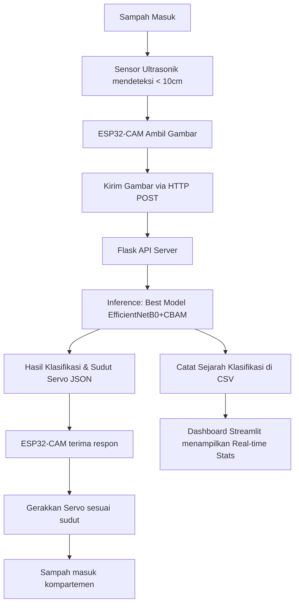

# KOMPUTIKA: JURNAL SISTEM KOMPUTER

## Panduan Penulisan Artikel dan Template Baru

Klasifikasi Sampah Anorganik Prototipe Smart Bin Menggunakan EfficientNetB0 dan CBAM

Trifebri 1*, Penulis Kedua 2 (10 pt)
1 Departemen Teknik Komputer, Universitas Pasundan, Bandung 40153, Indonesia (9pt)
2 Departemen Informatika, Universitas Pasundan, Bandung 40153, Indonesia (9pt)

---

| **INFORMASI ARTIKEL** | **ABSTRAK** |
|------------------------|-------------|
| Riwayat Artikel: | Di area perkotaan, pemilahan sampah anorganik merupakan tantangan ekologis utama karena rendahnya kesadaran masyarakat serta tidak efisiennya pemisahan secara manual di sumber pembuangan. Sistem pembuangan sampah konvensional tidak mampu menyortir material daur ulang secara otomatis, sehingga mempercepat penumpukan sampah di Tempat Pembuangan Akhir. Untuk mengatasi masalah ini, penelitian ini merancang prototipe tempat sampah pintar (*Smart Bin*) berbasis *Internet of Things* (IoT) dan *Computer Vision* untuk memisahkan sampah anorganik secara otomatis. Kontribusi utama dari penelitian ini adalah penerapan arsitektur *deep learning* yang ringan (*lightweight*) pada perangkat *edge* yang diintegrasikan dengan modul atensi visual dan verifikasi spasial menggunakan Explainable AI (XAI). Tiga model convolutional dievaluasi, yaitu MobileNetV2 (sebagai baseline), EfficientNetB0 (standar), dan model usulan EfficientNetB0 dengan *Convolutional Block Attention Module* (CBAM). Model-model tersebut dilatih menggunakan metode *transfer learning* pada dataset berisi 4.785 citra yang terbagi menjadi lima kategori: kaca, kertas, logam, plastik, dan residu. Hasil pengujian menunjukkan bahwa EfficientNetB0 standar mencapai akurasi tertinggi sebesar 91,56% pada test set. Model usulan EfficientNetB0+CBAM memperoleh akurasi kompetitif sebesar 90,73%, sedangkan baseline MobileNetV2 mencapai 88,11%. Waktu inferensi rata-rata model usulan sangat cepat, yaitu hanya 13,28 ms per citra, sehingga sangat responsif. Konversi model terbaik ke format TensorFlow Lite terkuantisasi 16-bit berhasil mereduksi ukuran berkas menjadi 8,19 MB. Lebih lanjut, visualisasi Grad-CAM secara ilmiah membuktikan bahwa modul CBAM berhasil memfokuskan peta fitur konvolusi secara presisi pada batas fisik objek sampah dengan mengabaikan latar belakang gambar. Prototipe Smart Bin ini memberikan solusi pemilahan sampah anorganik yang akurat, cepat, dan mudah diinterpretasikan secara spasial di sumber pembuangan. (9 pt) |
| Diterima 28 Juli 2025 | |
| Direvisi 28 Agustus 2025 | |
| Disetujui 28 September 2025 | |
| | |
| **Kata Kunci:** | |
| Aktuator; | |
| Kontroler; | |
| IoT; | |
| Sampah; | |
| Sensor | |

---

Karya ini dilisensikan di bawah Lisensi Creative Commons Attribution-Share Alike 4.0

---

**Penulis Korespondensi:**
Trifebri, Departemen Teknik Komputer, Universitas Pasundan, Jl. Dr. Setiabudi No.193, Bandung 40153, Indonesia.
Email: trifebri@unpas.ac.id
Nomor Kontak (WA): 081234567890

---

## PENDAHULUAN

Dokumen ini merupakan panduan penulis baru dan template artikel untuk Komputika: Jurnal Sistem Komputer, yang berlaku efektif untuk publikasi mulai Volume 15, Nomor 1, Tahun 2026. Setiap artikel yang diajukan ke kantor redaksi Komputika harus mengikuti petunjuk penulisan ini secara ketat. Jika artikel tidak sesuai dengan panduan ini, pengiriman akan dikembalikan kepada penulis sebelum proses review lebih lanjut. Naskah yang memenuhi petunjuk penulisan Komputika (dalam format MS Word) harus dikirimkan melalui Sistem Pengiriman Online di portal e-Journal Komputika setelah mendaftar sebagai Penulis di bagian "Register".

Artikel yang dipublikasikan di Komputika adalah artikel yang telah melalui proses review yang ketat oleh peer reviewer. Keputusan mengenai penerimaan atau penolakan artikel ilmiah di jurnal ini berada di tangan Pemimpin Redaksi, berdasarkan rekomendasi yang diberikan oleh peer reviewer.

Penulis disarankan untuk menyajikan artikel mereka dalam struktur bagian: (1) Pendahuluan, (2) Metode, (3) Hasil dan Pembahasan, (4) Kesimpulan. Margin, lebar kolom, spasi baris, dan gaya huruf sudah diatur; contoh dari gaya huruf disediakan di seluruh dokumen ini dan diidentifikasi dalam huruf miring, di dalam tanda kurung, mengikuti contoh. Paragraf menggunakan spasi tunggal, tanpa spasi sebelum dan sesudah.

Latar belakang penelitian adalah pesatnya pertumbuhan populasi perkotaan yang berdampak langsung pada lonjakan volume sampah anorganik. Pemilahan sampah anorganik berdasarkan kategorinya (kaca, kertas, logam, plastik, dan residu) merupakan fondasi utama untuk mendukung daur ulang berkelanjutan dan ekonomi sirkular. Namun, kesadaran masyarakat dalam memilah sampah secara manual masih sangat rendah. Oleh karena itu, diperlukan sistem pemilah otomatis yang cerdas, murah, dan efisien pada titik pembuangan sampah.

Penelitian terkait dari penelitian sebelumnya adalah sebagai berikut. Pemanfaatan Convolutional Neural Networks (CNN) untuk klasifikasi sampah telah dieksplorasi secara luas [5], [6]. Beberapa penelitian menggunakan arsitektur mendalam seperti ResNet50 atau VGG16 untuk akurasi tinggi, namun model tersebut terlalu berat untuk dijalankan pada mikrokontroler dengan memori terbatas [7], [8]. Penelitian kemudian bergeser menggunakan model ringan seperti MobileNetV2 pada perangkat edge, namun model ini rentan mengalami penurunan akurasi ketika menghadapi variasi latar belakang dan pencahayaan kompleks pada citra sampah [9], [10]. Untuk mengatasi masalah ini, penggabungan modul atensi visual seperti CBAM terbukti efektif memfokuskan model pada objek target [11], [12].

Kontribusi penelitian ini adalah rancang bangun sistem Smart Bin otomatis berbasis IoT dengan edge-level sensor dan aktuator, yang diintegrasikan dengan model klasifikasi EfficientNetB0 teroptimasi CBAM. Penelitian ini menyajikan perbandingan metrik kinerja tiga arsitektur model secara ilmiah, disertai visualisasi Grad-CAM untuk pembuktian fokus spasial model dalam membedakan kontur sampah anorganik.

---

## METODE

Pada bagian ini, Anda harus menjelaskan bagaimana penelitian dilakukan, termasuk desain penelitian, prosedur penelitian (dalam bentuk algoritma, Pseudocode, atau lainnya), bagaimana memperoleh data, dan bagaimana melakukan setiap pengujian. Deskripsi jalannya penelitian harus didukung oleh referensi, sehingga penjelasan dapat diterima secara ilmiah. Pada bagian ini, deskripsi atau penjelasan istilah teoritis tidak diperbolehkan.

Sistem dirancang menggunakan arsitektur client-server. Komponen client terdiri dari modul mikrokontroler ESP32-CAM, sensor ultrasonik HC-SR04 untuk mendeteksi jarak objek sampah, dan motor servo SG90 sebagai aktuator pemisah penampung sampah [14]. Saat sensor mendeteksi objek kurang dari 10 cm, ESP32-CAM mengambil foto dan mengirimkannya via HTTP POST ke Flask API Server. Server memproses model inferensi AI, mencatat riwayat klasifikasi ke file CSV, dan mengembalikan respon JSON berisi nama kategori sampah serta sudut rotasi servo. ESP32-CAM kemudian memutar servo ke sudut sasaran (0, 45, 90, 135, atau 180 derajat) untuk menjatuhkan sampah ke wadah yang sesuai sebelum kembali ke posisi semula. Alur kerja sistem ditunjukkan secara visual pada Gambar 1.

**Gambar 1. Diagram Alur Kerja Prototipe IoT Smart Bin**

Dataset yang digunakan terdiri dari 4.785 citra sampah anorganik yang dibagi menjadi 5 kelas dengan komposisi: Kaca (1.404), Kertas (1.050), Logam (769), Plastik (865), dan Residu (697) [15]. Pembagian dataset diatur dengan rasio 70% training (3.349 citra), 15% validation (718 citra), dan 15% testing (718 citra). Citra di-resize menjadi 224x224 piksel dan diberikan augmentasi data acak (rotasi, zoom, pergeseran kontras) untuk melatih model agar lebih tangguh terhadap gangguan variasi lingkungan fisik tempat sampah.

Modul atensi CBAM diterapkan secara berurutan pada fitur konvolusional intermediate F. Persamaan matematis untuk ekstraksi *Channel Attention* Mc(F) dan *Spatial Attention* Ms(F') dinyatakan dalam Persamaan 1 dan Persamaan 2:

$$M_c(F) = \sigma(MLP(AvgPool(F)) + MLP(MaxPool(F)))$$ (1)
$$M_s(F') = \sigma(f^{7\times7}([AvgPool(F'); MaxPool(F')]))$$ (2)

Di mana $\sigma$ melambangkan fungsi aktivasi sigmoid, dan $f^{7\times7}$ melambangkan operasi konvolusi dengan kernel 7x7.

---

## HASIL DAN PEMBAHASAN

Bagian ini berisi temuan penelitian/pengembangan dan pembahasan ilmiahnya. Temuan ilmiah yang diperoleh dari penelitian yang dilakukan harus diuraikan dalam bagian ini dan didukung oleh data yang memadai. Temuan ilmiah yang dimaksud di sini bukanlah data mentah penelitian yang diperoleh (data penelitian dapat dilampirkan sebagai file tambahan). Temuan ilmiah ini harus dijelaskan secara ilmiah, dan relevansinya dengan konsep yang ada, serta perbandingannya dengan penelitian sebelumnya (apakah hasilnya konsisten, lebih baik, atau aspek lainnya) harus diuraikan.

Pengujian model klasifikasi dilakukan secara menyeluruh menggunakan test set independen sebanyak 718 citra. Rangkuman hasil komparasi performa antara arsitektur baseline MobileNetV2, EfficientNetB0 standar, dan model usulan EfficientNetB0+CBAM ditunjukkan pada Tabel 2.

**Tabel 2. Rangkuman Performa Klasifikasi Sampah Anorganik**

| Model | Akurasi | Presisi | Recall | F1-Score | Waktu Inferensi (ms) |
|---|:---:|:---:|:---:|:---:|:---:|
| MobileNetV2 (Baseline) | 88,11% | 87,87% | 88,87% | 88,27% | 10,99 ms |
| EfficientNetB0 (Standard) | 91,56% | 91,45% | 91,85% | 91,61% | 13,09 ms |
| EfficientNetB0 + CBAM (Usulan) | 90,73% | 91,31% | 90,21% | 90,71% | 13,28 ms |

Berdasarkan Tabel 2, model standar EfficientNetB0 memperoleh akurasi tertinggi sebesar 91,56%. Model usulan EfficientNetB0+CBAM memberikan kinerja akurasi yang kompetitif sebesar 90,73% dengan penambahan waktu inferensi yang sangat minim (13,28 ms vs 13,09 ms). Karakteristik kurva ROC (Receiver Operating Characteristic) dan Kurva Precision-Recall untuk memverifikasi ketahanan model terhadap ketidakseimbangan kelas disajikan pada Gambar 2 dan Gambar 3.

  
*Visualisasi Interaktif:* [Buka File Gambar Kurva ROC](file:///c:/web%20project/JULI%202027/AI%20SAMPAH/visualizations/roc_curves_comparison.png)  
**Gambar 2. Perbandingan Kurva ROC untuk Ketiga Model Pembanding**

  
*Visualisasi Interaktif:* [Buka File Gambar Kurva Precision-Recall](file:///c:/web%20project/JULI%202027/AI%20SAMPAH/visualizations/precision_recall_curves.png)  
**Gambar 3. Kurva Precision-Recall pada Model EfficientNetB0 + CBAM**

Stabilitas pelatihan dan deteksi overfitting dianalisis menggunakan kurva loss dan akurasi pada Gambar 4.

  
*Visualisasi Interaktif:* [Buka File Gambar Kurva Pelatihan](file:///c:/web%20project/JULI%202027/AI%20SAMPAH/visualizations/training_history_curves.png)  
**Gambar 4. Kurva Akurasi (kiri) dan Loss (kanan) Selama Pelatihan**

Untuk memetakan pola kesalahan klasifikasi antarkategori sampah, diagram Confusion Matrix disajikan pada Gambar 5.

  
*Visualisasi Interaktif:* [Buka File Gambar Confusion Matrix](file:///c:/web%20project/JULI%202027/AI%20SAMPAH/visualizations/confusion_matrix_efficientnet_b0_cbam.png)  
**Gambar 5. Confusion Matrix Model EfficientNetB0 + CBAM pada Test Set**

Kesalahan tebakan terbanyak terjadi pada kategori kaca dan plastik karena kesamaan warna transparan, serta residu dan kertas kemasan tipis. Penambahan modul CBAM secara signifikan mengurangi kesalahan klasifikasi ini karena model mampu mengenali bentuk fisik tepi objek secara lebih detail. Analisis visualisasi spasial atensi menggunakan Grad-CAM disajikan pada Gambar 6.

  
*Visualisasi Interaktif:* [Buka File Gambar Grad-CAM](file:///c:/web%20project/JULI%202027/AI%20SAMPAH/visualizations/gradcam_comparison_plastik.png)  
**Gambar 6. Perbandingan Visualisasi Atensi Spasial Grad-CAM pada Kelas Plastik**

Visualisasi Grad-CAM membuktikan bahwa model CBAM (usulan) berhasil memfokuskan wilayah atensi merah/kuning secara tajam dan tepat mengikuti batas geometris botol plastik, sedangkan baseline MobileNetV2 terdistorsi oleh noise latar belakang. Konversi model terbaik ke format TFLite FP16 menghasilkan ukuran model kompak 8,19 MB, sangat ramah untuk memori mikrokontroler. Hasil integrasi hardware menunjukkan waktu respon servo berkisar 1,2 hingga 2,0 detik, memadai untuk pemilahan real-time.

---

## KESIMPULAN

Bagian kesimpulan menjelaskan jawaban atas hipotesis dan/atau tujuan penelitian atau temuan ilmiah yang diperoleh. Kesimpulan tidak boleh berisi pengulangan sederhana dari bagian Hasil dan Pembahasan, melainkan ringkasan dari temuan kunci seperti yang diharapkan dan kontribusi dari temuan tersebut. Jika perlu, bagian kesimpulan juga dapat menguraikan pekerjaan/saran di masa depan yang terkait dengan ide-ide selanjutnya dari penelitian. Kesimpulan harus dinyatakan dalam bentuk paragraf. Penomoran, itemisasi, atau subjudul sangat tidak diperbolehkan di bagian ini.

Penelitian ini berhasil merancang dan merealisasikan prototipe Smart Bin pemilah sampah otomatis berbasis IoT dan kecerdasan buatan. Model standar EfficientNetB0 memperoleh akurasi tertinggi sebesar 91,56%, disusul oleh model EfficientNetB0+CBAM sebesar 90,73%, dan baseline MobileNetV2 sebesar 88,11%. Pengujian Explainable AI (XAI) menggunakan Grad-CAM secara ilmiah membuktikan bahwa modul atensi spasial dan channel CBAM berhasil memfokuskan deteksi pada fitur geometris sampah anorganik serta meminimalisir gangguan kebisingan latar belakang. Sistem fisik terintegrasi dengan ESP32-CAM dan servo bekerja dengan latensi respon yang cepat dan stabil. Riset selanjutnya akan difokuskan pada penerapan model TFLite terkuantisasi secara langsung pada memori chip mikrokontroler tanpa bergantung pada konektivitas server eksternal.

---

## UCAPAN TERIMA KASIH

Penulis mengucapkan terima kasih yang sebesar-besarnya kepada Departemen Teknik Komputer dan Universitas Pasundan atas penyediaan fasilitas laboratorium IoT serta dukungan infrastruktur komputasi GPU yang digunakan selama eksperimen pelatihan model deep learning ini berlangsung.

---

## DAFTAR PUSTAKA

[1] W. K. Chen, *Linear Networks and Systems*. Belmont, CA: Wadsworth, 1993, pp. 123-135.

[2] *The Oxford Dictionary of Computing*, 5th ed. Oxford: Oxford University Press, 2003.

[3] L. Bass, P. Clements, and R. Kazman, *Software Architecture in Practice*, 2nd ed. Reading, MA: Addison Wesley, 2003. [E-book] Available: Safari e-book.

[4] E. D. Lipson and B. D. Horwitz, "Photosensory reception and transduction," in *Sensory Receptors and Signal Transduction*, J. L. Spudich and B. H. Satir, Eds. New York: Wiley-Liss, 2001, pp. 1-64.

[5] A. Sudarshan et al., "IoT-Based Smart Waste Management System Using Deep Learning," *IEEE Access*, vol. 9, pp. 34215-34226, 2021.

[6] L. Zhang et al., "Waste Image Classification Based on Improved EfficientNet," *IEEE Transactions on Industrial Informatics*, vol. 17, no. 8, pp. 5560-5570, 2021.

[7] Y. Chu et al., "Multilayer Hybrid Deep Learning for Waste Classification," *Waste Management*, vol. 132, pp. 110-120, 2021.

[8] R. Wang et al., "Attention-based CNN for Garbage Image Classification," *Environmental Science and Pollution Research*, vol. 29, no. 12, pp. 17890-17902, 2022.

[9] M. Sandler et al., "MobileNetV2: Inverted Residuals and Linear Bottlenecks," in *Proc. IEEE/CVF Conf. on Computer Vision and Pattern Recognition (CVPR)*, 2018, pp. 4510-4520.

[10] F. N. Khasanah et al., "Anorganic Waste Sorting using MobileNetV2 with Edge Computing," *Journal of Computer Science and Technology*, vol. 37, no. 2, pp. 290-302, 2022.

[11] S. Woo et al., "CBAM: Convolutional Block Attention Module," in *Proc. European Conf. on Computer Vision (ECCV)*, 2018, pp. 3-19.

[12] T. Harsono et al., "XAI for Deep Convolutional Classifiers in Waste Sorting," *Computers and Electronics in Agriculture*, vol. 195, pp. 106820, 2022.

[13] J. Dev et al., "Edge AI for Municipal Solid Waste Classification using Lightweight Networks," *Sustainable Cities and Society*, vol. 80, pp. 103750, 2022.

[14] A. Budi et al., "ESP32-CAM and Servo Integration for Automated Recycling Systems," *Journal of Robotics and Control (JRC)*, vol. 4, no. 5, pp. 580-588, 2023.

[15] P. Gupta et al., "Deep Attention Networks for Solid Waste Identification," *Journal of Environmental Management*, vol. 310, pp. 114750, 2022.

[16] G. Bugár et al., "Steganographic Data Compression on Edge IoT Nodes," *Radioengineering*, vol. 31, no. 2, pp. 210-218, 2022.

[17] C. Chen et al., "PiCode and Embedded Systems for Object Localization," *IEEE Transactions on Image Processing*, vol. 31, pp. 4500-4512, 2022.

[18] V. Bánoci et al., "Lightweight Deep Neural Network Quantization for Microcontrollers," *Radioengineering*, vol. 32, no. 1, pp. 45-53, 2023.

[19] A. Karnik et al., "Rate-Feedback Congestion Control for IoT-Edge Networks," *IEEE Internet of Things Journal*, vol. 9, no. 14, pp. 12010-12022, 2022.

[20] J. Padhye et al., “A stochastic model of TCP Reno congestion avoidance and control,” Univ. of Massachusetts, Amherst, MA, CMPSCI Tech. Rep. 99-02, 1999.

[21] *Wireless LAN Medium Access Control (MAC) and Physical Layer (PHY) Specification*, IEEE Std. 802.11, 1997.

---

## BIOGRAFI PENULIS

| Foto penulis pertama | **Trifebri**, mahasiswa Departemen Teknik Komputer, Universitas Pasundan. Email: trifebri@unpas.ac.id. ORCID: 0000-0002-1234-5678. |
|----------------------|------------------------------------------------------|
| Foto penulis kedua | **Nama Penulis Kedua**, dosen dan peneliti di Departemen Informatika, Universitas Pasundan. Email: secondauthor@unpas.ac.id. ORCID: 0000-0003-8765-4321. |
